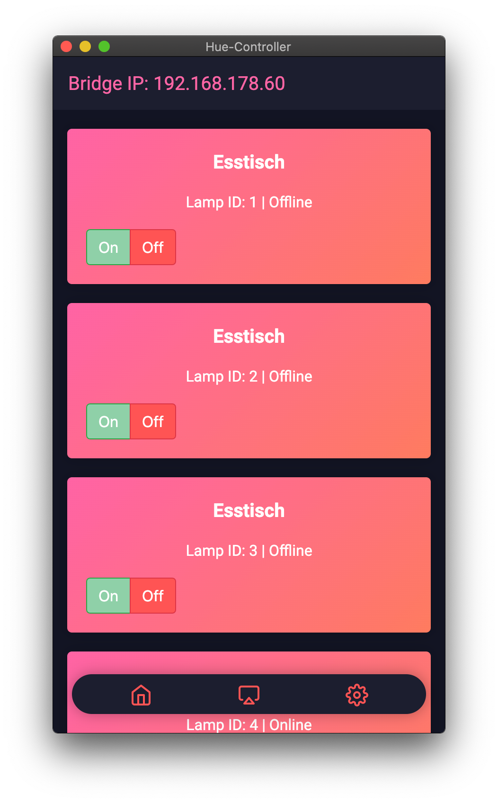

      
  <h1 align="center">
    Philips-Hue Controller
  </h1>

<h3 align="center">
  Electron App to Controll Zigbee Lights using your Philips Hue Bridge
</h3>

## Installation
Installation is easy! Just follow these Steps:
- Download the Repository and install the required Packages using `npm install`
- Open the Application using `npm start` and copy the IP Adress
- Open a Browser and go to `https://YOUR_BRIDGE_IP/debug/clip.html`
- Type in **URL** `/api` and in **Message Body** `{"devicetype":"huecontroller#developer"}`
- Click on the **Post** Button and copy the String under `username`.
- Paste your Username into the correct key inside `settings.json`

Restart the Application and you should be ready to go! Please note that in future Releases the Application will create its own Username.

## Todo
- Add Room Support
- Add Color Support
- Clean up my messy messy code (seriously what the hell)
- Added Color-Shift acording to Music / Screen Content

## Why should i use this?
Signify already offers a way to control lamps via the Philips Hue Bridge. The problem with this solution, however, is that an entertainment area has to be created in the app. However, the entertainment area can only be equipped with original Philips Hue lamps, LED strips, etc.

## UI
