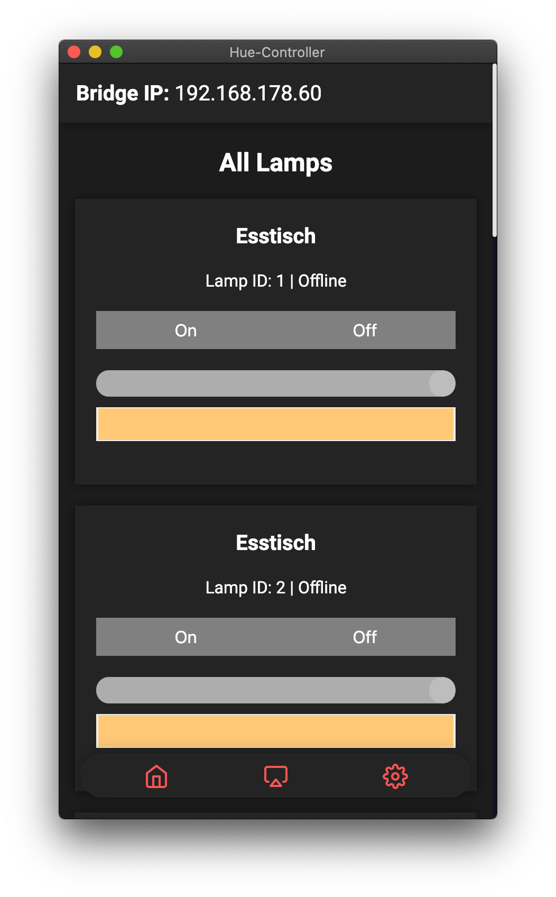

      
  <h1 align="center">
    Philips-Hue Controller
  </h1>

<h3 align="center">
  Electron App to Controll Zigbee Lights using your Philips Hue Bridge
</h3>

<h3 align="center">
        
      
      
      
</h3>

## Installation
Installation is easy! Just follow these Steps:
- Download the Repository and install the required Packages using `npm install`
- Start the Application using `npm start`

.. and you're done! Hue controller will do the rest. Just follow the steps inside the program

## Todo
- [X] Added Color-Shift acording to Music / Screen Content
- [X] Add Room Support
- [X] Transitions from request to Axios
- [X] Add Color Support

## Why should i use this?
Signify already offers a way to control lamps via the Philips Hue Bridge. The problem with this solution, however, is that an entertainment area has to be created in the app. However, the entertainment area can only be equipped with original Philips Hue lamps, LED strips, etc.. This trys to be an alternative to get the same functionality for non-Phillips Branded Lamps.

## UI

| Unavailable Lamps | Available Lamps |
| ----------------- | --------------- |
|  |  |

 
